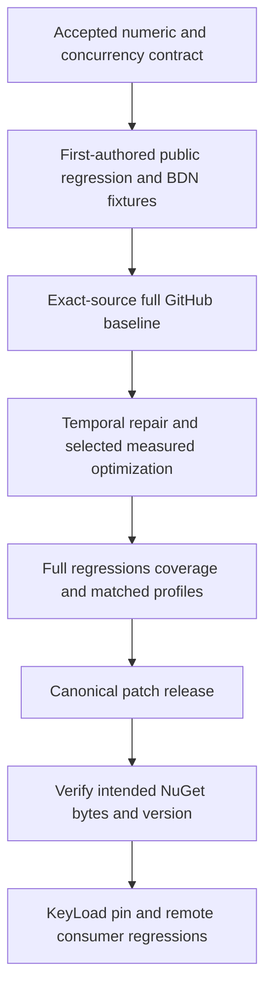

# ADR-0002: measured ingestion and exact temporal arithmetic

Status: Accepted; runtime evidence and patch delivery pending.

## Decision

Repair public wrong-sign temporal overflow with checked representability, preserving
signatures and valid rounded results. Preserve DateTimeOffset.Round's documented
offset while rounding its UTC instant. Establish representative real ingestion
allocation/capacity profiles before choosing production optimizations. Preserve
ConcurrentDictionary/CAS, thread-safe reads/writes, strategies and wire contracts.

Related requirements/acceptance: REQ-TS-101..106 and AC-TS-101..106 in the
[Feature](../Features/performance-and-temporal-arithmetic.md).

## Ordered implementation contract

1. Root planning owner reads owning policy/overview, retains main23632b9f baseline
   and unrelated dirty package/version changes, completes development build/format.
2. Bounded economical test worker owns only new TemporalRounding-prefixed test
   files. Public scalar BigInteger oracle proves all rounding modes and overflow,
   invalid inputs and offset/Kind behavior. It cannot modify production until root
   reviews actual new-case baseline failures from GitHub.
3. Independent economical benchmark worker owns only benchmark Program.cs and new
   TimeSeriesIngress-prefixed fixtures/support. MemoryDiagnoser, deterministic
   timestamps/values, observable output, setup separation, same/multiple buckets and
   capped64/4096 sequential/late-ingress cases. Root owns workflow and shared files.
4. Root compiles/formats, commits scoped fixtures without unrelated changes, pushes
   normally and joins full native baseline tests and benchmark artifacts.
5. The temporal worker then repairs only the existing rounding extension/tests.
   One serialized performance owner may change BaseTimeSeries/BaseNumberTimeSeriesSummer
   and ingestion regressions after root selects a measured candidate. No simultaneous
   same-file edits, new locks, numeric policy changes or unsafe SIMD approximation.
6. Root reviews every diff, joins full tests, 90% coverage, format/build, repeated
   baseline/candidate profiles, and reports remaining gaps without invented metrics.
7. Root increments canonical Version/PackageVersion using Directory.Build.props,
   commits relevant repair scope, pushes without force or bypass, follows canonical
   release through successful publication and verifies NuGet availability.
8. Root updates KeyLoad central pin only after feed proof, then joins focused and
   broader exact-source KeyLoad GitHub TUnit/RF3/SDK/MCP/TimeSeries regressions.

Expected artifacts: public regression cases/native reports, BDN raw JSON/CSV/Markdown
with runtime/CPU/source/workload identity and hashes, coverage, owner/consumer run
URLs/SHAs, NuGet feed/package receipt. A pushed commit alone is not delivery.
The original library release commands remain canonical. No local runtime tests or
benchmarks are run for this KeyLoad work.

## Execution ownership update (2026-10-03)

The human explicitly delegated the owning dependency repair and delivery to the
Luna worker. Luna is the sole TimeSeries source, test, benchmark, workflow,
canonical patch-version, commit/push, release and NuGet-verification owner. Root
independently reviews each owning-repository diff and exact-SHA evidence and owns
the KeyLoad package reference and consumer regressions after both Core and Orleans
packages are available from the intended feed. Any new performance-source diff
requires its own concrete review packet before it is pushed.

The ordered contract above records the historical initial root stages and remains
in place. This dated addendum changes execution ownership only. The join points
are root review before the first candidate push; successful exact-SHA correctness,
90% line coverage and repeated ingestion profiles before selecting a production
optimization; another root review before pushing any later performance-source
change; and consumer work after package/feed verification. All Git protections,
qualification gates, public contracts and preservation requirements remain in
force.

## Compatibility, rollback and limits

No persisted data or Orleans converter fields migrate. Existing public/protected
signatures remain available. Out-of-range rounding throws rather than wrapping or
saturating; supported numeric-sum semantics remain unchanged. Package-pin rollback
is possible; dependency reversal requires a fresh patch version rather than
overwriting a published version. Preserve unrelated work and no stash/force-push.
This library has no WAL/persistence or RF3 acknowledgement guarantee.
