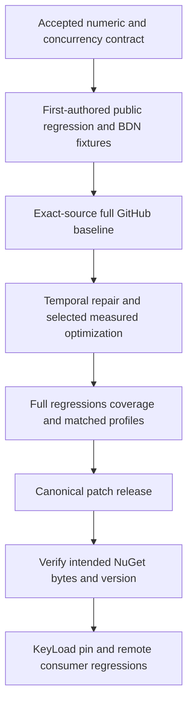

# ADR-0002: measured ingestion and exact temporal arithmetic

Status: Accepted; temporal arithmetic and release workflow repair are released in v10.0.2 with exact-source tests, coverage, native profiles, package signatures and feed payloads verified. The selected summer allocation candidate for v10.0.3 awaits exact-source correctness and repeated performance qualification.

## Decision

Repair public wrong-sign temporal overflow with checked representability, preserving
signatures and valid rounded results. Preserve DateTimeOffset.Round's documented
offset while rounding its UTC instant. Establish representative real ingestion
allocation/capacity profiles before choosing production optimizations. Preserve
ConcurrentDictionary/CAS, thread-safe reads/writes, strategies and wire contracts.

Related requirements/acceptance: REQ-TS-101..106 and AC-TS-101..106 in the
[Feature](../Features/performance-and-temporal-arithmetic.md).

## Ordered implementation contract

1. Root planning owner reads owning policy/overview, retains main23632b9f baseline
   and unrelated dirty package/version changes, completes development build/format.
2. Bounded economical test worker owns only new TemporalRounding-prefixed test
   files. Public scalar BigInteger oracle proves all rounding modes and overflow,
   invalid inputs and offset/Kind behavior. It cannot modify production until root
   reviews actual new-case baseline failures from GitHub.
3. Independent economical benchmark worker owns only benchmark Program.cs and new
   TimeSeriesIngress-prefixed fixtures/support. MemoryDiagnoser, deterministic
   timestamps/values, observable output, setup separation, same/multiple buckets and
   capped64/4096 sequential/late-ingress cases. Root owns workflow and shared files.
4. Root compiles/formats, commits scoped fixtures without unrelated changes, pushes
   normally and joins full native baseline tests and benchmark artifacts.
5. The temporal worker then repairs only the existing rounding extension/tests.
   One serialized performance owner may change BaseTimeSeries/BaseNumberTimeSeriesSummer
   and ingestion regressions after root selects a measured candidate. No simultaneous
   same-file edits, new locks, numeric policy changes or unsafe SIMD approximation.
6. Root reviews every diff, joins full tests, 90% coverage, format/build, repeated
   baseline/candidate profiles, and reports remaining gaps without invented metrics.
7. Root increments canonical Version/PackageVersion using Directory.Build.props,
   commits relevant repair scope, pushes without force or bypass, follows canonical
   release through successful publication and verifies NuGet availability.
8. Root updates KeyLoad central pin only after feed proof, then joins focused and
   broader exact-source KeyLoad GitHub TUnit/RF3/SDK/MCP/TimeSeries regressions.

Expected artifacts: public regression cases/native reports, BDN raw JSON/CSV/Markdown
with runtime/CPU/source/workload identity and hashes, coverage, owner/consumer run
URLs/SHAs, NuGet feed/package receipt. A pushed commit alone is not delivery.
The original library release commands remain canonical. No local runtime tests or
benchmarks are run for this KeyLoad work.

## Execution ownership update (2026-10-03)

The human explicitly delegated the owning dependency repair and delivery to the
Luna worker. Luna is the sole TimeSeries source, test, benchmark, workflow,
canonical patch-version, commit/push, release and NuGet-verification owner. Root
independently reviews each owning-repository diff and exact-SHA evidence and owns
the KeyLoad package reference and consumer regressions after both Core and Orleans
packages are available from the intended feed. Any new performance-source diff
requires its own concrete review packet before it is pushed.

The ordered contract above records the historical initial root stages and remains
in place. This dated addendum changes execution ownership only. The join points
are root review before the first candidate push; successful exact-SHA correctness,
90% line coverage and repeated ingestion profiles before selecting a production
optimization; another root review before pushing any later performance-source
change; and consumer work after package/feed verification. All Git protections,
qualification gates, public contracts and preservation requirements remain in
force.

## Release workflow contract amendment (2026-10-03)

Related requirement/acceptance: REQ-TS-106 and AC-TS-106 in the
[Feature](../Features/performance-and-temporal-arithmetic.md).

The v10.0.1 duplicate run proved that `--skip-duplicate` returned exit code zero,
set `published=true`, and replaced the existing GitHub release assets with
repacked bytes. The owning release workflow must keep fresh NuGet publication and
release asset mutation distinct and verifiable.

Ordered implementation contract:

1. Luna owns `.github/workflows/release.yml`; require the Release job's build,
   full owning xUnit suite, and at least 90% line coverage before package publish.
2. Validate the artifact directory contains exactly the Core and Orleans nupkg
   pair for the canonical version. Pass the NuGet key through a masked environment
   variable and quote its use.
3. Publish without `--skip-duplicate`. Record successful uploads and duplicate
   conflicts separately. All-duplicate runs set `published=false` and skip the
   release job. Mixed new/duplicate outcomes and all non-duplicate provider errors
   fail the workflow visibly, with no release asset update.
4. Before creating a tag/release, fail if that version tag already exists. Never
   overwrite or replace a pre-existing tag or GitHub release asset.
5. Retain source SHA, run/job URLs, test/coverage/package artifacts, package
   SHA-256 values, feed availability and package hashes, package IDs/versions,
   repository commit metadata, and GitHub release asset hashes.
6. For a fresh patch release, independently verify package IDs, versions,
   repository commit metadata and assembly payloads from the intended NuGet feed.
   Account for NuGet repository signing: verify the signature and compare
   extracted package entries, excluding only `.signature.p7s`, instead of
   requiring signed-feed ZIP bytes to equal the unsigned build artifact bytes.
   GitHub release assets must match the exact build artifact bytes. Then root owns
   the KeyLoad consumer update. A same-source manual dispatch after fresh release
   verifies duplicate detection and unchanged asset hashes. Mixed publication,
   provider-error, and pre-existing-tag branches are review-only; intentionally
   attempting a partial production release is not authorized.

Compatibility/rollback: keep package IDs and public APIs unchanged. Never delete
or overwrite already-published NuGet versions. Any correction to an already
published source requires a new canonical patch version. Root reviews the owning
workflow diff before the version bump is pushed; Luna implements and qualifies it.

## First profile-selected summer allocation stage (2026-10-03)

Related requirement/acceptance: REQ-TS-103 and AC-TS-103 in the
[Feature](../Features/performance-and-temporal-arithmetic.md).

The retained 43a1427 normal/scalar profiles show 160 allocated bytes per
same-bucket update for Int32/Int64/Double summers and 232 bytes for Decimal.
The bounded first candidate removes captured delegates from the existing
summer paths while keeping the concurrent dictionary compare-and-swap (CAS)
as the sole update implementation.

Ordered implementation contract:

1. Add a protected generic-state overload in `BaseTimeSeries<T, TSample, TSelf>`
   and keep its existing protected delegate-based overload intact. Both overloads
   must route into one CAS loop, with no direct storage bypass.
2. In `BaseNumberTimeSeriesSummer<TNumber, TSelf>`, pass `(this, value)` state
   and static add/update delegates for `AddData`, `Merge`, and `Resample`. The
   update delegate reads `Strategy` from the same instance on every retry.
3. Preserve all five supported numeric types, four strategies, numeric overflow
   policy, DataCount, UTC normalization, range, merge/resample and concurrent
   multi-writer behavior. Do not add locks, fields, wire data or collections.
4. Update owning tests before production code: matrix strategies and supported
   numeric types over both new and existing buckets; verify merge/resample; add
   multi-writer exact totals and range checks after quiescence.
5. Run owning Release build/formatter locally only. Qualification remains in
   GitHub Actions: full xUnit and 90% coverage, followed by the existing 16-case
   repeated normal/scalar ingestion profiles with exact checksums/source/runtime/
   CPU and raw operation counts. Compare matched profiles with 43a1427; do not
   call normalized 64-invoke batch results “per batch” when raw operation counts
   show per-update values.
6. Send root the complete source/test diff and hash for review before commit or
   push. If a later capacity proposal is selected, keep it separate and record
   the concurrent trimming contract and independent acceptance before editing.

Compatibility/rollback: public APIs and serialization remain unchanged; the
existing protected overload remains source-compatible. Revert the generic-state
path if matched profiles fail to reduce allocation without preserving every
correctness criterion. The 43a1427 profile is the retained baseline; no capacity
algorithm or claims are included in this stage.

## Compatibility, rollback and limits

No persisted data or Orleans converter fields migrate. Existing public/protected
signatures remain available. Out-of-range rounding throws rather than wrapping or
saturating; supported numeric-sum semantics remain unchanged. Package-pin rollback
is possible; dependency reversal requires a fresh patch version rather than
overwriting a published version. Preserve unrelated work and no stash/force-push.
This library has no WAL/persistence or RF3 acknowledgement guarantee.
