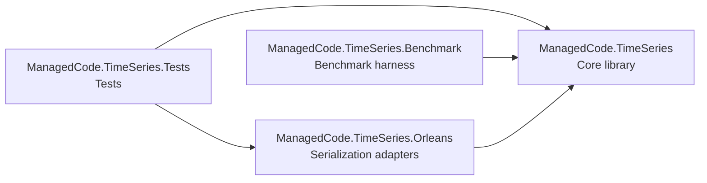
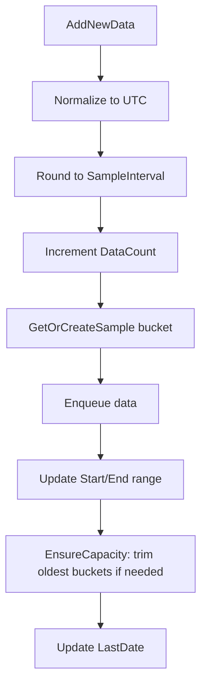
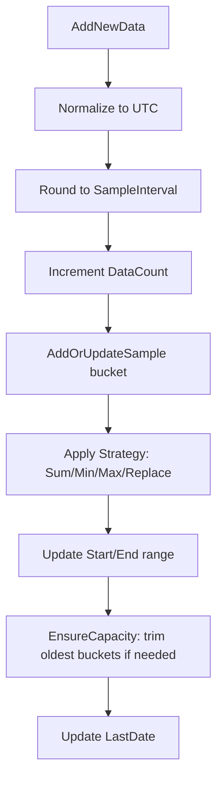
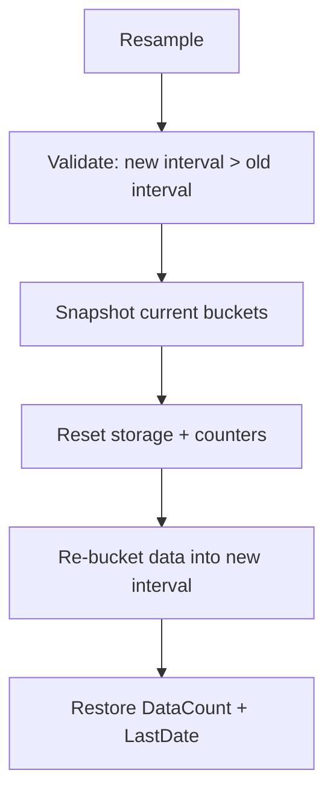
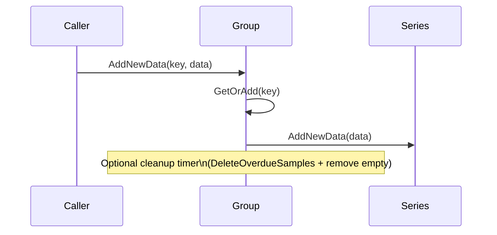

# Architecture Overview

This document is the entry point for architecture and module boundaries. Keep it short and link out to detailed ADRs and feature specs.

## Module Map



## Module Catalog

- ManagedCode.TimeSeries (core library)
  - Responsibilities: lock-free time-series accumulators/summers, shared abstractions, extensions.
  - Boundaries: performance-critical; avoid locks/extra allocations; public API lives here.
  - Key areas: `ManagedCode.TimeSeries/Abstractions`, `ManagedCode.TimeSeries/Accumulators`, `ManagedCode.TimeSeries/Summers`, `ManagedCode.TimeSeries/Extensions`.
- ManagedCode.TimeSeries.Orleans (adapters)
  - Responsibilities: Orleans surrogates/converters for core types.
  - Boundaries: serialization compatibility; no core logic changes here.
  - Key areas: `ManagedCode.TimeSeries.Orleans/Accumulators`, `ManagedCode.TimeSeries.Orleans/Summers`.
- ManagedCode.TimeSeries.Benchmark (benchmarks)
  - Responsibilities: BenchmarkDotNet harness for performance tracking.
  - Boundaries: benchmarks only; no production code.
  - Key areas: `ManagedCode.TimeSeries.Benchmark/Benchmarks`.
- ManagedCode.TimeSeries.Tests (tests)
  - Responsibilities: xUnit + Shouldly tests for core and Orleans adapters.
  - Boundaries: test-only helpers; no production dependencies.
  - Key areas: `ManagedCode.TimeSeries.Tests`.

## Core Workflows (Accumulators & Summers)

This section describes how the two main abstractions behave at runtime. It is intentionally detailed so changes can be reasoned about without reading the full codebase.

### Data Model (Core Structures)

```mermaid
flowchart LR
    subgraph Accumulator
        A[ConcurrentDictionary<DateTimeOffset, ConcurrentQueue<T>>]
    end
    subgraph Summer
        S[ConcurrentDictionary<DateTimeOffset, TSample>]
    end
    Count[DataCount (ulong)]
    Range[Start/End/LastDate (atomic)]
    A --> Count
    A --> Range
    S --> Count
    S --> Range
```

Notes:
- Accumulators keep raw events in a queue per bucket.
- Summers keep a single aggregated value per bucket.
- Timestamps are normalized to UTC; offsets are not stored.
- Range tracking is atomic and updated on every write.

### Accumulator Workflow (AddNewData)

Accumulators store per-bucket **queues** of raw events. Each bucket is a `ConcurrentQueue<T>` keyed by a rounded UTC timestamp.



Notes:
- Buckets are keyed by **UTC** `DateTimeOffset` (offset zero).
- Input `DateTimeOffset` values are normalized to UTC; offsets are not preserved.
- `Samples` is an ordered view; `Buckets` is an alias for the same ordered view.
- `MaxSamplesCount <= 0` means unbounded.
- Capacity trim removes the oldest buckets (by key order).

### Summer Workflow (AddNewData)

Summers store per-bucket **aggregated values** (e.g., sum/min/max) instead of raw events.



Strategy details:
- `Sum`: add value to bucket.
- `Min/Max`: track the extreme in the bucket.
- `Replace`: overwrite with the latest value.

### Resample Workflow (Accumulators & Summers)

Resampling widens the interval and rewrites buckets:



### Group Workflow (Keyed Aggregation)

Group types manage a dictionary of accumulators/summers keyed by string:



### Thread Safety Model

- All public types are designed for concurrent reads/writes.
- Core storage uses `ConcurrentDictionary`/`ConcurrentQueue` plus atomic counters and range tracking.
- Enumerations of concurrent collections are snapshot-style (eventually consistent) and safe for iteration during writes.
- Concurrent queues are retained to preserve lock-free multi-writer safety, even when background cleanup timers run.

## Dependency Rules

- Allowed
  - `ManagedCode.TimeSeries.Orleans` -> `ManagedCode.TimeSeries`
  - `ManagedCode.TimeSeries.Benchmark` -> `ManagedCode.TimeSeries`
  - `ManagedCode.TimeSeries.Tests` -> `ManagedCode.TimeSeries` and `ManagedCode.TimeSeries.Orleans`
- Forbidden
  - `ManagedCode.TimeSeries` must not depend on Orleans, Tests, or Benchmarks.
  - Tests and Benchmarks must not be referenced by production projects.
  - Orleans adapters must not depend on Benchmarks or Tests.

## Related Docs (Link Index)

- ADRs: [ADR index](../ADR/index.md), [ADR-0001 UTC-normalized timestamps](../ADR/0001-utc-normalization.md)
- Features: [Feature index](../Features/index.md), [Accumulators and Summers](../Features/accumulators-and-summers.md)
