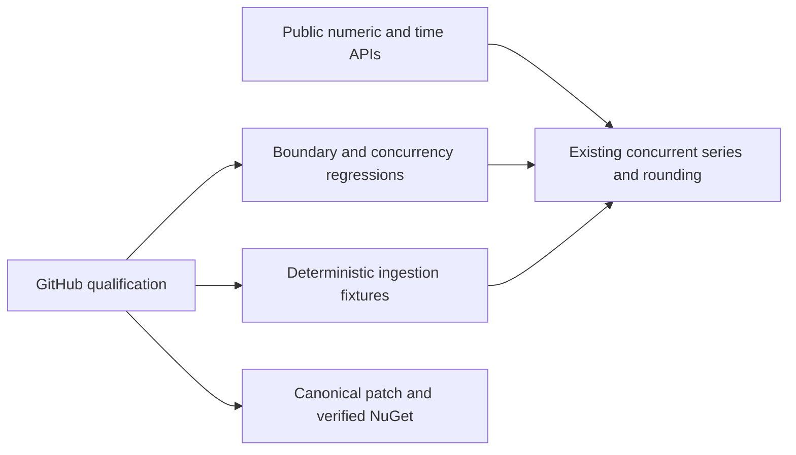

# Performance and temporal arithmetic

Status: temporal arithmetic is released in v10.0.1 and its native regression suite passes; release publication integrity is repaired and qualified in v10.0.2. The approved summer allocation candidate is prepared for v10.0.3 and awaits exact-source correctness, coverage and repeated performance qualification. This slice remains in progress until the selected summer change passes all gates and the owning release/feed proof is complete.

## Requirements and acceptance

| Requirement | Acceptance | Contract and verification |
| --- | --- | --- |
| REQ-TS-101 | AC-TS-101 | Round TimeSpan with exact integer semantics for all five MidpointRounding modes; throw OverflowException when the rounded result is not representable. Invalid intervals/modes reject before fast-path return. Public xUnit BigInteger-oracle boundary tests cover both extrema, neighbours, ties, exact multiples and zero. |
| REQ-TS-102 | AC-TS-102 | DateTimeOffset.Round preserves its input offset while rounding the UTC instant; RoundUtc produces offset zero. Public positive/negative-offset, Kind and temporal boundary regressions. |
| REQ-TS-103 | AC-TS-103 | Selected summer allocation repairs preserve strategy, supported numeric semantics, UTC keys, DataCount, range, merge/resample and multi-writer totals. Real concurrent/scalar tests and matched BDN bytes/time per ingestion operation. |
| REQ-TS-104 | AC-TS-104 | Capacity changes require retained baseline profiling first; keep oldest-bucket removal and configured capacity after quiescence, late-arrival and concurrent safety. BDN64/4096 capped ingress plus actual changed-path regressions. |
| REQ-TS-105 | AC-TS-105 | Deterministic BDN setup is outside measured work; checksums, runtime/CPU/source/version/workload, allocations and hardware-disabled/native reports remain observable. Filterable CLI and repeated exact-source GitHub measurements; unmatched workloads/CPU cannot support a performance claim. |
| REQ-TS-106 | AC-TS-106 | Canonical scoped patch release passes owning build/format/full tests/90% coverage, publishes the exact Core and Orleans package pair through GitHub, and is verified available from intended NuGet before consumer update. Duplicate packages must not count as a fresh publication or replace an existing tag/release asset. Keep source SHA/run/job/native artifacts and feed receipt. |

No new collection types, serialization fields, storage backend, numeric-sum overflow
policy, Rust dependency or speculative SIMD is included. In-memory library
measurements do not establish durable single-node/RF3 database superiority.
.NET intrinsics remain the first option only after arithmetic dominance is measured.

## Slice and verification map

- Core: existing Extensions/RoundDateTimeAndTimeSpanExtensions.cs and, only after
  profiling, Abstractions/BaseTimeSeries.cs and BaseNumberTimeSeriesSummer.cs.
- Tests: new TemporalRounding-prefixed files in ManagedCode.TimeSeries.Tests;
  changed ingestion paths receive real numeric/concurrent regressions.
- Benchmarks: new TimeSeriesIngress-prefixed files under benchmark Benchmarks;
  Program.cs uses the existing BenchmarkDotNet assembly with CLI filtering.
- Infrastructure: root-owned performance workflow and canonical release workflow.
- Orleans: wire shape unchanged; existing converter regression suite remains required.
- UI: N/A, library has no UI.
- ADR: [0002](../ADR/0002-performance-and-temporal-arithmetic.md).

Tests run using the owning xUnit/VSTest project, not KeyLoad's TUnit runner.
For this KeyLoad dependency work runtime tests/benchmarks execute in GitHub;
development builds and formatter results are distinct evidence.
Manual review complements automated tests for ownership, source/artifact matching
and unchanged wire fields; no numeric coverage exception is authorized.

## Execution ownership update (2026-10-03)

The human explicitly delegated the ManagedCode.TimeSeries dependency repair and
release to the Luna worker. Luna is the sole source-repository owner for the
accepted TimeSpan/DateTimeOffset repair, any profile-selected TimeSeries
optimization, owning regressions and benchmarks, owning CI qualification, the
canonical patch version, scoped commits/pushes, GitHub release and NuGet feed
verification. Luna preserves unrelated pre-existing central package pins and
coordinates any changed performance implementation with the root reviewer before
the next push. Root independently reviews every owning diff and exact-source
evidence, then owns the KeyLoad package update and consumer regressions only after
the Core and Orleans packages are available from the intended feed.

The original ordered stages and historical root ownership above remain as the
record of the initial plan. This dated addendum changes the execution owner only;
it does not change REQ-TS-101..106, AC-TS-101..106, package/public contracts,
verification gates, or release protections. Join points are: root review before
the first candidate push; exact-SHA GitHub test/coverage and repeated ingestion
profiles before any performance change; root review before a later
performance-source push; and root consumer work after both feed packages and
their bytes are verified.

### AC-TS-106 release-contract addendum (2026-10-03)

The canonical `.github/workflows/release.yml` release may proceed only after the
Release job completes build, full xUnit tests and at least 90% line coverage. It
must receive exactly `ManagedCode.TimeSeries.$VERSION.nupkg` and
`ManagedCode.TimeSeries.Orleans.$VERSION.nupkg`. A fresh release requires both
packages to be newly accepted by NuGet in that run; an all-duplicate run reports
no fresh publication and skips GitHub release/tag asset updates. A mixed
fresh/duplicate result or any non-duplicate publish error fails visibly and
cannot create a GitHub release. An existing version tag fails before release
asset upload, so existing tag assets remain untouched. NuGet API credentials are
passed through a masked step environment variable, not interpolated into shell
source.

Automated evidence: the successful fresh-version Release workflow must retain the
exact-SHA build, test, coverage, package-pair and publish outputs; feed package
IDs, versions, repository commit metadata and assembly payloads must match the
uploaded build artifacts. Verify NuGet repository signatures and compare
extracted package contents while accounting for the `.signature.p7s` entry;
GitHub release asset bytes must match the build artifacts exactly. A same-SHA
manual canonical dispatch verifies the all-duplicate path and unchanged release
asset hashes.
Review-only exceptions: mixed publication, provider-error and existing-tag guards
are checked by reviewing the workflow and native failure handling rather than
deliberately attempting a partial or conflicting production release.

### AC-TS-103 summer-update allocation addendum (2026-10-03)

The first profile-selected optimization is limited to captured delegates in
`BaseNumberTimeSeriesSummer<TNumber, TSelf>`. Preserve the existing protected
`AddOrUpdateSample(DateTimeOffset, Func<TSample>, Func<TSample, TSample>)`
signature and route both it and a new generic-state overload through one CAS
implementation in `BaseTimeSeries`. The summer passes `(this, value)` state and
static add/update delegates from `AddData`, `Merge`, and `Resample`; update
retries read the current `Strategy` from that same instance. Keep Sum, Min, Max,
Replace, numeric overflow behavior, DataCount, UTC keys, ranges, merge/resample
results, cancellation and concurrency semantics unchanged. Do not bypass the
CAS with direct storage writes or introduce locks.

Automated evidence: owning xUnit tests cover all supported numeric types
(int32, int64, float, double, decimal), every strategy, same-key updates,
new-key adds, merge, resample, and exact concurrent totals/ranges after writers
quiesce. GitHub Actions must pass the full owning test suite and 90% line
coverage, then the unchanged 16-case repeated normal and scalar BDN matrix must
retain checksums and report per-update timing/allocation from raw operations
counts. The 43a1427 ingestion profile is the pre-change baseline; no local
runtime tests or benchmark runs qualify this acceptance.

Deferred capacity candidate: the 43a1427 profile identifies capped retention as
another allocation hotspot, but its concurrent trimming semantics remain under
review. The current work does not change `EnsureCapacity` or its range logic.
Any later capacity implementation needs its own bounded concurrency contract,
late-arrival and multi-writer regressions, and source review before profiling.

### Exact-source execution record (2026-10-03)

- `43a142759d3b9fa65d10a58559def98ab0020b75` delivered the temporal arithmetic
  repair as v10.0.1; its exact-source Release job passed. The later v10.0.1
  duplicate-run asset overwrite is retained as a delivery defect and was repaired
  by the v10.0.2 release workflow contract.
- `64cba752e366fec74f8a09c0450ce724d483012e` made the capacity fixture start
  deterministic. Its full performance workflow later passed, including all
  repeated normal/scalar measurements; the earlier failed IsFull timing fixture
  is retained in the plan history.
- `2c9118b6fbd45a5170682d345d66cba4ad6e8f2d` delivered v10.0.2. Its Release
  workflow passed build and 1104/1104 xUnit tests; line coverage was Core 668/710
  (94.08%) and Orleans 205/212 (96.70%). Both packages were freshly published,
  signed feed contents matched the package payloads, and a same-source duplicate
  dispatch skipped release mutation with unchanged asset hashes. Its native
  performance run passed all four repeated 16-case normal/scalar profiles and is
  the exact pre-summer baseline at `/private/tmp/timeseries-run-2c9118b/`.
- The current generic-state summer candidate retains the original protected
  callback API and one CAS loop. Its source/test diff is under root review; no
  10.0.3 performance or release claim is made until a fresh exact-source GitHub
  run passes all correctness, coverage, profile and feed gates.
