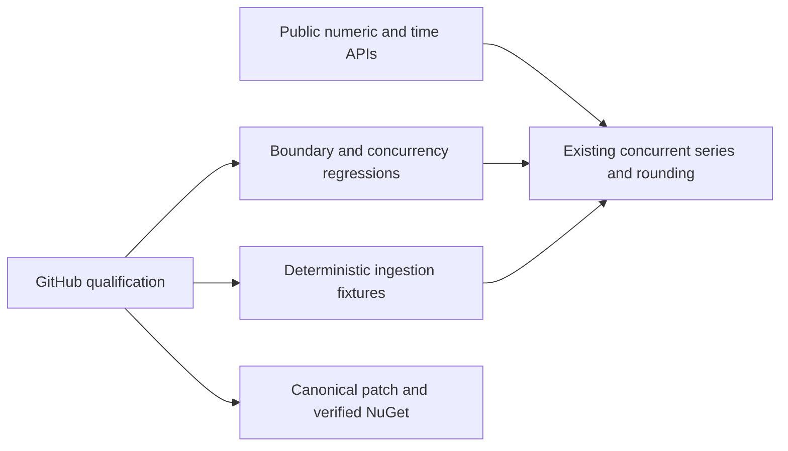

# Performance and temporal arithmetic

Status: source contract accepted; implementation and current-source GitHub evidence pending.

## Requirements and acceptance

| Requirement | Acceptance | Contract and verification |
| --- | --- | --- |
| REQ-TS-101 | AC-TS-101 | Round TimeSpan with exact integer semantics for all five MidpointRounding modes; throw OverflowException when the rounded result is not representable. Invalid intervals/modes reject before fast-path return. Public xUnit BigInteger-oracle boundary tests cover both extrema, neighbours, ties, exact multiples and zero. |
| REQ-TS-102 | AC-TS-102 | DateTimeOffset.Round preserves its input offset while rounding the UTC instant; RoundUtc produces offset zero. Public positive/negative-offset, Kind and temporal boundary regressions. |
| REQ-TS-103 | AC-TS-103 | Selected summer allocation repairs preserve strategy, supported numeric semantics, UTC keys, DataCount, range, merge/resample and multi-writer totals. Real concurrent/scalar tests and matched BDN bytes/time per ingestion operation. |
| REQ-TS-104 | AC-TS-104 | Capacity changes require retained baseline profiling first; keep oldest-bucket removal and configured capacity after quiescence, late-arrival and concurrent safety. BDN64/4096 capped ingress plus actual changed-path regressions. |
| REQ-TS-105 | AC-TS-105 | Deterministic BDN setup is outside measured work; checksums, runtime/CPU/source/version/workload, allocations and hardware-disabled/native reports remain observable. Filterable CLI and repeated exact-source GitHub measurements; unmatched workloads/CPU cannot support a performance claim. |
| REQ-TS-106 | AC-TS-106 | Canonical scoped patch release passes owning build/format/full tests/90% coverage, publishes through GitHub, and is verified available from intended NuGet before consumer update. Keep source SHA/run/job/native artifacts and feed receipt. |

No new collection types, serialization fields, storage backend, numeric-sum overflow
policy, Rust dependency or speculative SIMD is included. In-memory library
measurements do not establish durable single-node/RF3 database superiority.
.NET intrinsics remain the first option only after arithmetic dominance is measured.

## Slice and verification map

- Core: existing Extensions/RoundDateTimeAndTimeSpanExtensions.cs and, only after
  profiling, Abstractions/BaseTimeSeries.cs and BaseNumberTimeSeriesSummer.cs.
- Tests: new TemporalRounding-prefixed files in ManagedCode.TimeSeries.Tests;
  changed ingestion paths receive real numeric/concurrent regressions.
- Benchmarks: new TimeSeriesIngress-prefixed files under benchmark Benchmarks;
  Program.cs uses the existing BenchmarkDotNet assembly with CLI filtering.
- Infrastructure: root-owned performance workflow and canonical release workflow.
- Orleans: wire shape unchanged; existing converter regression suite remains required.
- UI: N/A, library has no UI.
- ADR: [0002](../ADR/0002-performance-and-temporal-arithmetic.md).

Tests run using the owning xUnit/VSTest project, not KeyLoad's TUnit runner.
For this KeyLoad dependency work runtime tests/benchmarks execute in GitHub;
development builds and formatter results are distinct evidence.
Manual review complements automated tests for ownership, source/artifact matching
and unchanged wire fields; no numeric coverage exception is authorized.

## Execution ownership update (2026-10-03)

The human explicitly delegated the ManagedCode.TimeSeries dependency repair and
release to the Luna worker. Luna is the sole source-repository owner for the
accepted TimeSpan/DateTimeOffset repair, any profile-selected TimeSeries
optimization, owning regressions and benchmarks, owning CI qualification, the
canonical patch version, scoped commits/pushes, GitHub release and NuGet feed
verification. Luna preserves unrelated pre-existing central package pins and
coordinates any changed performance implementation with the root reviewer before
the next push. Root independently reviews every owning diff and exact-source
evidence, then owns the KeyLoad package update and consumer regressions only after
the Core and Orleans packages are available from the intended feed.

The original ordered stages and historical root ownership above remain as the
record of the initial plan. This dated addendum changes the execution owner only;
it does not change REQ-TS-101..106, AC-TS-101..106, package/public contracts,
verification gates, or release protections. Join points are: root review before
the first candidate push; exact-SHA GitHub test/coverage and repeated ingestion
profiles before any performance change; root review before a later
performance-source push; and root consumer work after both feed packages and
their bytes are verified.
